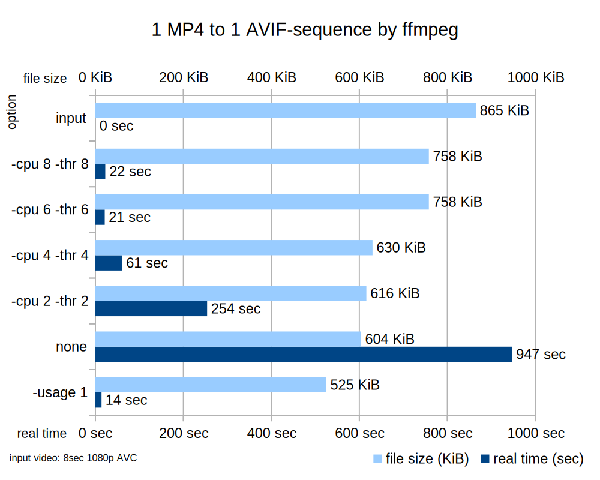
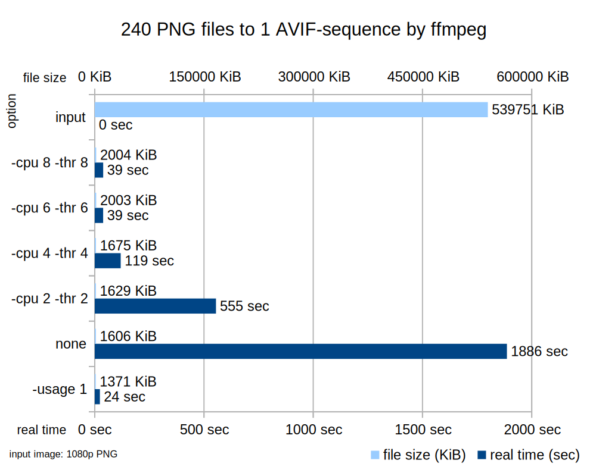

AV1, AVIF, AVIS(AVIF-sequences) をそれぞれ簡単に作って表示する記事です  
以前より簡単に作成できるようになったので記事にしました  
記事中の AVIF-sequences を再生できるのは Blink を搭載するChrome などのブラウザのみです

# Words
#### AOMedia (Alliance for Open Media)
  - https://aomedia.org
  - HEVCの特許料から逃れたい企業が集まり、圧縮技術を開発してロイヤリティフリーで提供している団体
#### AV1 (AOMedia Video 1)
  - https://aomedia.org/av1/specification
  - GoogleのVP9の技術を継承してAOMediaが開発したロイヤリティーフリーの映像圧縮フォーマット
  - MIME Type: `image/AV1`
  - https://www.iana.org/assignments/media-types/video/AV1
#### HEIF (High Efficiency Image File Format)
  - https://nokiatech.github.io/heif/
  - 複数の動画、画像、音声ファイルなどを含めることができるコンテナフォーマット
#### HEIF Image-derivations
  - 編集命令(回転など)を保存し非破壊な編集を可能にする
  - 編集前と後の画像を提供しつつファイル容量はほとんど増えない
#### HEIF Image-sequence
  - 時間的、空間的連続性を持つ複数の画像を保存する
  - 画像の数が多くなるほど大幅な圧縮ができる
#### AVIF (AV1 Image File Format)
  - https://aomediacodec.github.io/av1-avif
  - AV1の圧縮技術を画像用に転用しHEIFに収めたもの
  - MIME Type: `image/avif`
  - File extension: `.avif`, `.heif`, `.heifs`, `.hif`
  - https://www.iana.org/assignments/media-types/image/avif
#### AVIS (AVIF-sequences)
  - https://aomediacodec.github.io/av1-avif/#image-sequences
  - HEIFの image-sequence を使い複数の画像をまとめたもの
  - GIFアニメーションのように使うこともできる

# HEIF is container format
HEIF (High Efficiency Image File Format) はコンテナ内の画像の符号化方式によって個別の名称で呼ぶことができる

| Name      | AVIF | HEIC | AVIC |
|-----------|------|------|------|
| Codeing   | AV1  | HEVC | AVC  |
| Container | HEIF | HEIF | HEIF |

- https://en.wikipedia.org/wiki/High_Efficiency_Image_File_Format#Variants

# How to convert AV1, AVIF and AVIS?
適切にエンコード設定を行なうことで、使用目的に合った品質のメディアを出力できます  
この記事の計測結果は目安であり、特に各種ソフトウェアの性能を比較するために使用するのは不適切と思われます  
計測用の動画や画像データは全て下記の動画データから得ています  
```
http://distribution.bbb3d.renderfarming.net/video/mp4/bbb_sunflower_1080p_30fps_normal.mp4
CC-BY: Blender Foundation, Janus Bager Kristensen
```

## AV1
### Input
Video: AVC, 886KiB 1920x1080, 30FPS, 8sec, yuv420p  

### Command
- `ffmpeg -i avc.mp4 -vcodec libaom-av1 -cpu-used 8 -threads 8 av1.mp4`
- `av1an -i avc.mp4 av1.mp4`

### Results
|                 | video length | real time | file size | codec |
|-----------------|--------------|-----------|-----------|-------|
| input           | 8 sec        | N/A       | 886 KiB   | avc   |
| ffmpeg          | 8 sec        | 20.57 sec | 758 KiB   | av1   |
| ffmpeg -usage 1 | 8 sec        | 3.16 sec  | 525 KiB   | av1   |
| av1an           | 8 sec        | 30.77 sec | 896 KiB   | av1   |

- あまり圧縮されなかった、恐らく動画が短すぎたためだと思う
- bb_subflower全体だと 264MB => 197MBになった

### Note
- `-usage 1` (output)を使用して少し品質を犠牲に高速に処理できます
- [次世代ビデオコーデックAV1を使ったライブ配信 - さくらのナレッジ](https://knowledge.sakura.ad.jp/30017/)

## AVIF
### Input
Image: MJPEG, 101KiB, 1920x1080, yuvj420p

### Command
- `ffmpeg -i input.jpg output.avif`
- `convert input.jpg output.avif`

### Results
|                      | real time | file size | file type |
|----------------------|-----------|-----------|-----------|
| input                | N/A       | 104 KiB   | jpeg      |
| ffmpeg               | 17.74 sec | 38 KiB    | avif      |
| ffmpeg -cpu 8 -thr 8 | 1.64 sec  | 38 KiB    | avif      |
| imagemagick          | 2.27 sec  | 38 KiB    | avif      |

### Note
- ffmpeg n5.1 はアルファチャンネル(透過画像)を処理できませんでした

### Sample
<div style="display: flex ">
  
  
  
</div>

## AVIS (AVIF-sequences) from MP4
### Input


### Command
- `ffmpeg -i input.mp4 output.avif`

### Output


### Results


| option        | video length | real time | file size | file type |
|---------------|--------------|-----------|-----------|-----------|
| none          | 8 sec        | 947 sec   | 604 KiB   | avis      |
| -cpu 2 -thr 2 | 8 sec        | 254 sec   | 616 KiB   | avis      |
| -cpu 4 -thr 4 | 8 sec        | 61 sec    | 630 KiB   | avis      |
| -cpu 6 -thr 6 | 8 sec        | 21 sec    | 758 KiB   | avis      |
| -cpu 8 -thr 8 | 8 sec        | 22 sec    | 758 KiB   | avis      |
| -usage 1      | 8 sec        | 14 sec    | 525 KiB   | avis      |
| input         | 8 sec        | N/A       | 865 KiB   | mp4       |

- cpu-used [1-8] の値を増やすと圧縮率が低下する反面、処理時間が減少する傾向が見られた

### Sample


## AVIS (AVIF-sequences) from PNG files
### Input
- Image: PNG, 1920x1080, yuv420p

### Command
- `ffmpeg -i input%03d.jpg output.avif`
- https://ffmpeg.org/ffmpeg-formats.html#gif-2

### Results


| option        | number of image | real time (sec) | file size (KiB) | file type |
|---------------|-----------------|-----------------|-----------------|-----------|
| -usage 1      | 1 image         | 24 sec          | 1371 KiB        | avis      |
| none          | 1 image         | 1886 sec        | 1606 KiB        | avis      |
| -cpu 2 -thr 2 | 1 image         | 555 sec         | 1629 KiB        | avis      |
| -cpu 4 -thr 4 | 1 image         | 119 sec         | 1675 KiB        | avis      |
| -cpu 6 -thr 6 | 1 image         | 39 sec          | 2003 KiB        | avis      |
| -cpu 8 -thr 8 | 1 image         | 39 sec          | 2004 KiB        | avis      |
| input         | 240 images      | N/A             | 539751 KiB      | png       |

- cpu-usedを指定せずに240個のPNGから1個のAVIF-sesequenceを作成した所、540MiB => 1.4MiB と約336倍の圧縮率になった

### Note
- Firefox v104 はAVIF-sequencesの再生に対応していません
- imagemagick v7.1.0-47 はAVIF-sequencesを作成できませんでした

### Sample


# Support
## Browser
| Browser Name        | Engine | AV1                    | AVIF                    | AVIS (AVIF-sequences) |
|---------------------|--------|------------------------|-------------------------|-----------------------|
| Firefox             | Gecko  | 2019-03-21 (v67)       | 2021-10-02 (v93)        | Not support           |
| Chrome              | Blink  | 2018-10-16 (v70)       | 2020-08-25 (v85)        | 2020-08-25 (v85)      |
| Safari              | WebKit | Not support            | Scheduled support (v16) | Not support           |
| Firefox for Android | Gecko  | 2022-03-31 (v101-flag) | 2022-03-31 (v101)       | 2022-03-31 (v101)     |
| Chrome for Adnroid  | Blink  | 2022-08-03 (v104)      | 2022-08-03 (v104)       | 2022-08-03 (v104)     |
| Safari for iOS      | WebKit | Not support            | Scheduled support (v16) | Not support           |

- AV1, AVIFのユーザカバー率は70%程度
- ただし Safari v16では対応する予定で、これにより最新の主要ブラウザ全てが対応することになりユーザカバー率は85%程度に上昇すると思われる (Safari v16 は2022年後半に配信予定)
  - https://webkit.org/blog/12998/release-notes-for-safari-technology-preview-149

- EdgeとIEはAV1, AVIFをサポートしていない
- HEVC のサポートはSafariのみでユーザカバー率は20%程度
- HEICはどのブラウザもサポートしていない
- WEBM, WEBP のユーザカバー率は95%程度
- https://caniuse.com
- https://en.wikipedia.org/wiki/AVIF#Support

### Note
- WebページでAV1, AVIFを使う場合は`<source>`要素を使ってJPEGなどの代替形式をフォールバック指定するとよい
  - https://developer.mozilla.org/ja/docs/Web/HTML/Element/source

## SoC H/W encode/decode
- 一般的に専用回路で処理すると計算資源、消費電力、時間を大幅に節約できる
- Apple のA16 と M2 はいずれもサポートしていない
- Google Tensorはdecodeのみサポートしている
- https://www.anandtech.com/show/17032/tensor-soc-performance-efficiency
- https://en.wikipedia.org/wiki/AV1#Hardware

## 分散SNS
- mastodonはAVIFの投稿に対応していない
  - https://github.com/mastodon/mastodon/issues/18762#issuecomment-1173700036

# 雑感
- ディスプレイが高画質になったため、表示するデータの画質も大きくなっており、ストレージ圧迫を軽減できる
- 動画や画像を保存している人、配信している人、従量課金で動画や画像を通信する人、みんなにコスト削減の効果が有る
  - NASのデータをPCやタブレットでストリーミングする人
  - 大量にデータを持ち歩く人でもストレージの小さな端末が購入の選択肢になる
- 高圧縮なので再生のための解凍には、従来より多くの計算資源を必要とする
  - 特にAVISでは顕著で例えば私の実行環境で当記事を表示させるとCPUを約3%使用する
  - H/W decodeに期待したい
- イラストの表情差分などや多言語漫画など、似通った画像でHEIFコンテナを使うと大きなサイズ圧縮効果を得られると思う
- AVIS (AVIF-sequences)はループ再生されるようなGIFやMP4の代替として期待できる
- AVIFの再生には課題を感じた
  - プラグインなしで再生できるのはブラウザだけでAVIF-sequenceはChromeしか対応していない
  - AVIF-sequenceもアニメーションではなく1枚1枚表示できるものは見当たらなかった
  - AVIF-derivationsをサポートするツールは見つからなかった

# Links
- [AVIFを試す - 記憶は人なり](https://wave.hatenablog.com/entry/2019/09/07/080800)
- [☀️ダイナミックデスクトップ壁紙 - みずぴー日記](https://mzp.hatenablog.com/entry/2018/09/26/201751)
- [ImageMagick で画像のフチの背景色を切り取って透明に - kitsuyui](https://qiita.com/kitsuyui/items/1d60fe20930bc17302be)

### Sample


# 実行環境
## Hardware
- CPU: AMD Ryzen 7 5800X
- RAM: Kingston KSM26ED8/16HD (16GB-DDR4-2666MT/s)

## Software
- kernel: 5.19.5-arch1-1
- ffmpeg: n5.1
  - version n5.1 (release: 2022-07-23)以降が恐らく必要です
- av1an: 0.3.1
- imagemagick: 7.1.0-47
  - version 7.1.0-39 (release: 2022-06-20)以降が恐らく必要です
- file: 5.42
  - version 5.40 (release: 2021-03-30)以降が恐らく必要です
- qView: 5.0
- Firefox: 104
- Chromium: 104.0.5112.101
- qt-avif-image-plugin: 0.48

## Data
```
# Download
curl -O http://distribution.bbb3d.renderfarming.net/video/mp4/bbb_sunflower_1080p_30fps_normal.mp4

# Crop
ffmpeg -ss 1:36 -i bbb_sunflower_1080p_30fps_normal.mp4 \
       -an -t 8 bbb_sunflower_1080p_30fps_normal_clip_9s.mp4

# Take a frame
ffmpeg -t 1 -i bbb_sunflower_1080p_30fps_normal_clip1_8s.mp4 \
       -r 1 -f image2 bbb_sunflower_1080p_30fps_normal_clip1_8s%d.png

# mp4 to png
ffmpeg -i input.mp4 -r 60 png/%04d.png

# delete backgraund
convert input.png \
  -alpha set \
  -background none \
  -channel RGBA \
  -fill '#00000000' \
  -fuzz 45% \
  -draw 'alpha 1,1 floodfill' \
  output.png
  
```

### ehe


#### TEXT LICENSE CC-BY